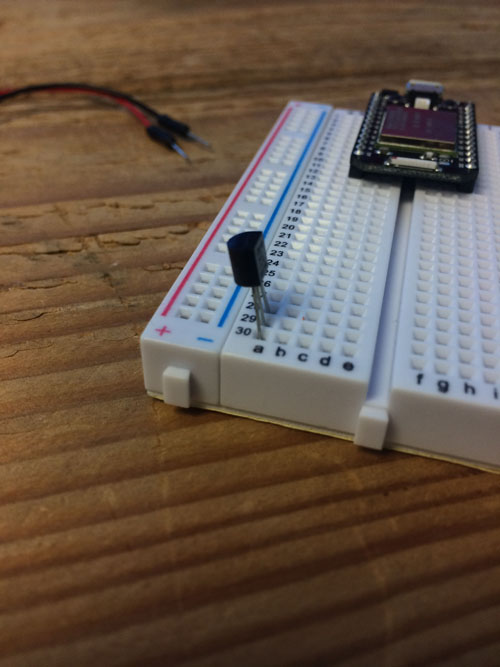
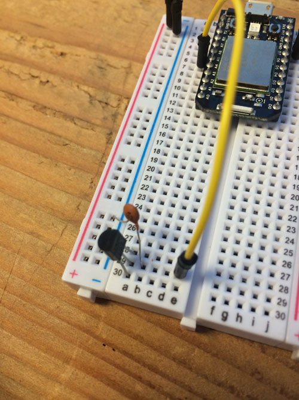

#Class notes

**What we're going to cover today:**

* What's in the box
* The setup steps we're skipping over
* The Hello World of the hardware world: Making a light blink
* Thermometer, wires and the Core
* The code we'll need
* Now we connect the dots -- Spark to IFTTT to Google

###What's in the box###

* Check out the Core itself, and the breadboard
* What is a breadboard? 
* Wires, capacitors, sensors oh my

###The setup we're skipping###

* Each core must be "claimed" by an account
* That's the secret sauce behind the connections
* Thus, you're accounts have already been created

###Hello World###

* In the IDE on Spark.io, find the Blink an LED example
* Familiarize yourself with the buttons on the left
* Fork the example
* Change the delay
* Congrats! You're a hardware hacker now.

###Thermometer, wires and the Core###

Step | Image
:----|:-----
Step 1: First, let's get the board set up. Depending on your board, this will look a little different, but put the board at the top and the thermometer at the bottom. | 
Step 2: Take a good look at the thermometer. You want he flat side facing in toward the middle of the board for this demonstration. So long as you know where positive and negative are, you can do this any way you want. But for this demonstration, your thermometer needs to look like this. | 
Step 3: The first wires we're going to add are simple ones: We're going to power the + and - channel on the breadboard. Convention is to use a red wire for positive, black wire for negative. Plug in a red wire next to the 3.3V pin on your board, and connect the other end to the + channel. Now do the same for black, plugging it into a GND pin and the - channel. | 
Step 4: On your thermometer, you'll see three pins. The middle pin is the signal pin. On the same row as the middle pin, plug a yellow wire in the same row, but leave at least one empty space between the signal pin and your wire. Plug the other end of your yellow signal wire into an analog pin. They start with A. Doesn't matter which one, so long as you remember it and change your code later to listen to that pin. Mine is in A5 on the Particle Core board. | 
Step 5: Now we need a new part: The capacitor. Your kit has two kinds, one is smaller and has 103 on the front, one is slightly bigger and has 104 on the front. We want the 103 one. This is what it looks like. | 
Step 6: The reason we left a space between the signal pin on our thermometer and our signal wire is that we need to plug one side of a capacitor in between the two and the other side into ground (the - channel). What this does is "settle down" the signal, giving you more stable, reliable readings. | 
Step 7: Now all that is left is to complete the circuit for our thermometer. The top pin is the negative/ground pin, so take a black wire and plug it into the same row as the top pin on the thermometer. Plug the other end into the ground/- channel. | 
Step 8: Now do the same for the positive. Take a red wire, plug it into the same row as the bottom pin of the thermometer. Now plug the other end into the +/positive channel. | 

###The Code###

* Follow along with the code on the screen. 
* The same code is in this repository as well.
* NOTE: REMEMBER TO CHANGE THE PIN NUMBER IN THE VOID SETUP AND VOID LOOP AREAS TO REFLECT WHICH PIN YOU PLUGGED YOUR YELLOW WIRE INTO. Without it, it won't work right. 

###Connecting the dots###

* Create an IFTTT account if you haven't already.
* Search for Spark and [find one that logs events in Google Drive](https://ifttt.com/recipes/244508-log-events-in-google-drive).
* Add your Spark account to it (your username and password have been provided) and connect your Google Account to it (you can use your own or you can use the one created for this class).
* The event name is temperature -- you'll add that in the recipe

###Finishing up###

* Power up the Core and load the software on there if you haven't already.
* What's wrong? 
* Analog signals, noise and how to deal with it.

**Last step: Stand in awe of what you have done. Imagine the possibilities.** 

